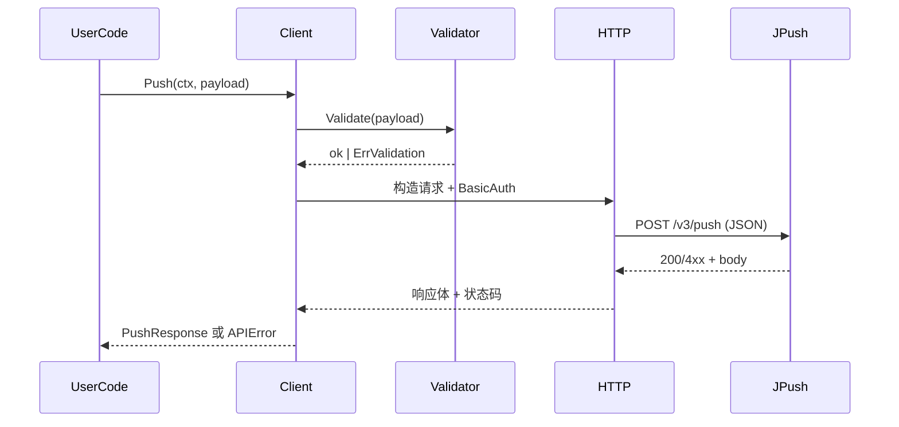

# 项目重构方案（保持功能等价、现代化重构）

> 目的：在不新增功能的前提下，重构为更现代、易用、可维护的开源库。保持与现有 JPush REST API 行为兼容。

## 指导原则
- 仅使用标准库，最小依赖；上下文优先、可注入传输层；发送前校验；错误可预期且携带上下文；提供向后兼容的薄包装。
- 采用语义化版本，软弃用旧接口，确保 JSON 线格式与现有版本兼容。

## 重构后架构
```mermaid
graph TD
    A[公共 API 层\njpush 包] --> B[Client 核心\n构造、认证、超时]
    B --> C[HTTP 传输层\n可注入 RoundTripper]
    B --> D[Payload 构建器\nplatform/audience/notification/message/sms]
    B --> E[校验\n发送前检查]
    B --> F[响应模型\n结构化解析与错误映射]
    C --> G[JPush REST\npush/schedule/report/cid/sms]
    B --> H[示例 & 文档\npush/CID/SMS 演示]
    B --> I[测试\n单元 + 集成(带 tag)]
```

## 公共 API 设计
- `type Client struct { baseURLPush; baseURLSchedule; baseURLReport; baseURLCID; baseURLSMS; httpClient *http.Client }`
- 构造：`NewClient(appKey, masterSecret string, opts ...Option)`
- 可选项：`WithHTTPClient`、`WithTimeout`、`WithBaseURLs`、`WithLogger`（钩子）、`WithRetry`（后续可选）。
- 方法（context 优先）：  
  - `Push(ctx, payload *PushPayload) (*PushResponse, error)`  
  - `ScheduleCreate/Get/Delete(ctx, …)`  
  - `CID(ctx, count int, pushType string) (*CIDResponse, error)`  
  - `SendSMS(ctx, payload *SMSPayload) (*SMSResponse, error)`
- 兼容性：保留旧签名（返回 `string,error`）作为薄包装，标记 `Deprecated:`。

## Payload 与模型
- 构建器提供默认值：`NewPushPayload()` 初始化 `Options`（如 `ApnsProduction=false`）。
- 校验：必须有 platform、audience；校验 tag 数量、APNs badge、SMS 模板参数等；校验失败直接返回 `ErrValidation`。
- 响应结构体：`PushResponse{MsgID int64; SendNo int64; Error *APIError}` 等，避免字符串解析。
- 错误模型：`APIError{Code int; Message string; HTTPStatus int}`，区分网络、校验、解码错误。

## HTTP 层
- 统一 `do(ctx, method, url string, body any) ([]byte, *http.Response, error)`，JSON 编解码封装。
- 使用 `req.SetBasicAuth`；`context.WithTimeout` 提供每次请求超时；允许注入自定义 `RoundTripper` 便于 tracing/mock。
- 默认 `http.Client{Timeout: 60s}`；User-Agent/版本头。
- 重试策略暂保留钩子，不默认重试以避免隐藏重放。

## 测试策略
- 单元测试：使用 mock RoundTripper 覆盖 push/schedule/report/CID/SMS 的成功与 API 错误路径。
- 校验测试：缺 platform/audience、SMS 模板参数缺失等。
- 集成测试（`-tags=integration`）：需要真实凭证，默认跳过。
- 采用 golden JSON 比对请求体，确保线格式兼容。
- 默认 `go test ./...`；可选 `gofmt`/`golangci-lint`。

## 文档与示例
- `README.md`（英文默认）+ `README.zh.md` 已拆分；补充新 API 用法与迁移说明。
- `examples/` 更新为 context API，展示错误处理。
- `CHANGELOG` 记录弃用/破坏性变化；迁移指南展示新旧调用对照。

## 迁移与兼容
- 旧函数继续存在（薄包装），在注释中标 `Deprecated:`，计划在下一个大版本移除。
- 确保 JSON 序列化输出一致（用 golden 测试验证）。
- 新接口返回结构化响应，旧接口继续返回字符串以兼容存量调用。

## 包结构建议
```
jpush/
  client.go          # Client、Option、do
  endpoints.go       # 各 REST URL 常量
  payload_push.go    # Platform/Audience/Notification/Message/LiveActivity/Options/PushPayload
  payload_sms.go     # SMSPayload、TempPara
  response.go        # PushResponse/ScheduleResponse/CIDResponse/SMSResponse/APIError
  validation.go      # payload 校验
  transport_mock.go  # 测试用 RoundTripper mock
  examples/...
```

## 实施步骤（顺序执行）
1) 引入新 `Client` 与 context 优先方法；保留旧包装。  
2) 抽象统一 HTTP do 层，支持超时和可注入 Transport。  
3) 增加结构化响应与错误模型，替换内部字符串解析。  
4) 增加 payload 校验和默认值，保证序列化兼容（通过 golden）。  
5) 编写单元测试（mock Transport）与校验测试；标记集成测试。  
6) 更新示例、README（中英）、CHANGELOG/迁移指南。  
7) 可选：添加简单 CI（lint+test），保持 gofmt。  

## 请求流程（Push）

